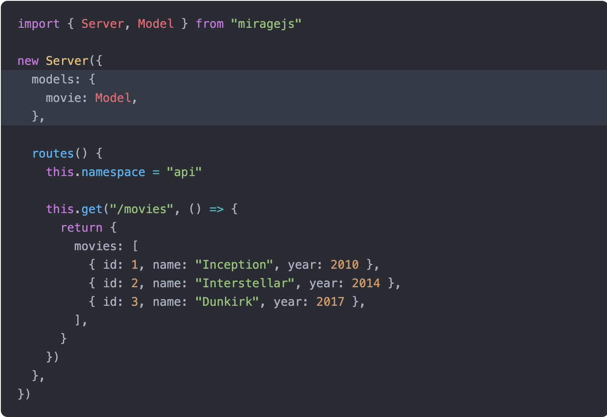

# Mini história do JavaScript

Sem JS, só página estática, ASP, PHP, né.
Bora botar JS. Dar dinamicidade. Mudar cor, moviemntar elementos, inputs, etc.
Evoluão CSS, JS, HTML.
JS ganha tração. Pessoal começa a ver que é melhor do que fazer desktop, Delphi, Windows.
Muito custoso fazer coisa em JS, espicificacao, falta de API.
Fizeram JQuery, Jânio Quários.

## Frameworks

Os deputados do JS sentaram num bar pra tomar uma cerveja (ou outras coisas aí...).

- "Rapaz, esse negocio de js ta pegando mermo."
- Um doidão falou "como dizia um filosofo grego: 'se alguma coisa pode ser escrita em javascript, ela vai ser escrita em javascript'"
  Alguém deve ter falado: "Já sei! Genial! Vocês vão ver! A gente uns padrão de projeto massa. Que lida muito com UI, async, event loop, thread, um nao interrompe o outro, nao pode travar a UI, nao pode demorar muito"
- "Vai dar certo não. A turma entrou no Jquery, pra tirar uma pessoa é complicado, ta faltando alguma coisa na vida da pessoa, tem que evangelizar a pessoa, eh dificil tirar. Criamos o ceu na terra. Um framework que ja faz as coisas tudo certo, arquitetura.
- "E as biblioteca? Como vamo pensar num jeito pra galera contribuir um com o outro e ja usar as coisas que ja existem hoje e tal..."
- Naaaao, mo vei. Cada framework ai faz do seu jeito e se funcionar com JS normal, beleza, senao, quero saber nao.

Isso aconteceu em 87 lugares oa mesmo tempo. Cada um que fosse minion do seu framework, guerras aconecendo no mundo inteiro, ate a galera enteder que nao era por ai.

## Pegou!

Tambem, Jquery antes, ne...
Produtividade sucesso
Poderes grandes para o JS
O js tira os elemento, troca a pagina, controla tudo, evento, rota, ajax, dados.
Reativo, massa, muito mais possibilidade, com agilidade, com certa DX.

# mpa vs spa

SPA traz muita vantagem. Ficou evidente.
Na Capyba trabalhamos muito.

## Estrutura

Tem muita coisa lá dentro, vou listar

### Auth

cookie, token, jwt, local storage

### Rotas

Conteudo hierarquico, paginas, sub paginas, lista, detalhe, etc., arvore
MPA tambem tem isso.

### Arquitetura / Gerenciamento de estado

MVC
MVVM (mermao, as coisa eh muito doida)
MVW (sem comentarios, bota o que quiser ai)
Redux
Padroes: observable, services, repositorios
Bloc

Controlar o estado. Contador: valor atual do contador.
Listagem de alunos: a lista eh o estado. Se estamos esperando o resultado, isso eh estado, se retornou erro, eh estado.
Redux, mobx, change notifiers, etc.

### Componentes

Modularizacao, separacao de responsabilidades, reuso, organizacao em geral.

Angular tem, React tem, Vue tem, Web Components! padrao nativo e tal.

### Comunicacao dos componentes

No react, passando pra cima e pra baixo. Fizeram redux. No angular services podem ser providos em certo ponto da arvore e providos dali pra baixo. Singleton, Factory, etc.

### Front do front

OOCSS, SMACSS, BEM, functional css, styled components.

Modal, dropdown, tooltip, pegar da biblioteca, implemtnar, jquery

UX? Sentimento do usuario ao executra acoes, encontrando informacoes, app facilitando a vida, stressando, pra que vai fazer, ta no contexto certo, etc.

### Segurança

---

### Comunicaãco com api

axios

fetch

xml http request
Piada do errrado, tudo na vida eh equilibrio, tem dois pontos de vista, respeitar opiniao, mas aquilo ali eh errado po. Claramente errado. `CODIGO`
serviu! usam por baixo dos panos pra fazer as coisas.

# Vida real!

Feature nova, projeto novo.
Tomara que nunca passem por isos, mas se passar, vou contar como fizemos.
Processo de decisao SPA - angular, interface massa e tal, ionic, pwa, etc.

O dev frontend pede api
So sabe front, vai ser improdutivo
O bicho do back so pode daqui a 3 semanas
Por que nao comeca daqui a 3 semanas?
O cliente e tal, tem que adiantar coisas

Ai eh isso? Acabou? da ferias pro cara e so volta daqui a 3 semanas?

Muitas coisas envolvem criar uma SPA

Voce pensa logo em fazer a UI, navegavel. Protoipo de altissima fidelidade.
Telas navegaveis e tal.

Ai temrina. e a api? o cara so comecou agora. Django new

Ainda vai modelar, vai demorar.

Vai ficar parado? Nao. Tem coisa pra voce fazer.

Coisa muito importante no design eh dar sempre um feedback, uma resposta ao usaurio, tem que ser reativo.

Loading, mensagens de erro, sucesso.

## Solucoes

Botar um delay no codigo, retornar um erro.

Mexer no codigo e botar coisas que nao vao estar la no fim.

Pra dar erro, etem que ir no codigo e botar "agora vai dar erro!, eita!"

Tem como fazer o codigo independete e, quando tiver pronto, mudar quse nada.

Vai dar pra se preparar meeeesmo pro

- loading
- pro erro
- simular respostas erradas do backend - decoder e tal

## Mostrar esse prototipo mais foda ainda pro cliente

Chamar junto, dar pra ele testar com side effects reais, melhor ainda que o prototipo navegavel.

Requisitos podem surgir disso, dessa experiencia real do cliente.

Mudancas de modelagem nessa hora seriam muito mais baratas de se implementr.

Assim da pra fazer um deploy bem direitinho pro cliente chegar e dar pitaco.

Tem muito mais chance do cliente dar pitacos legais se tiver a sensacao de que ta acontecendo alguma coisa de verdade la.

Preenche o form, aparece o aluno na listagem, ele filtra, filtra direitinho e tal.

Voc pode mandar um deploy pro cliente, com efeitos reais, interacoes perfeitas, loading, erros, cliente pode sentir se as regras de negocio e UI estao atendendo ele.

No prototipo o cliente ve, estuda, da pitaco, itera, mas sempre tem coisa que ele so saca se precisa quando realmente chega la na frente e ele usa.

## Testes

Pode ser complicado ou simplista demais escrever testes só se utilizando de mock.

# Jeitos de fazer isso

- colocar no html os dados estaticamente
- criar model e interface pro model e instancia no component. a view ja fica real
- pra fazer funcionar, tem que adicionar codigo irreal ao component.
- pode ir no service e colocar as coisas la, mas ainda esbarramos no codigo irreal.
- tambem seria dificil implementar os side effects, da trabalho

## implementar um interceptor para o XMLHttpRequest do browser

teria que dar parse na url

lidar com a persistencia

# Fake backend com MirageJS

resolve tudo, se nao quiser implementar

se quiser, gostaria de ver uma palestrinha sobre isso!

inclusive, queremos desenvolver isso pro flutter!

- routes to handle HTTP requests
- a database and models for storing data and defining relationships
- factories and fixtures for stubbing data, and
- serializers for formatting HTTP responses

## Parse de rotas

### Get simples

é possível adicionar um parâmetro de timing para simular um delay real de uma requisição. **malicinha para deixar isso randomico**

### Post simples

### Delete com erro

## Rotas dinâmicas BD local

É sério! Existe! Funciona!

Estático é massa, mas bora ver, né. Isso aí a gente faria com as outras soluções. Vamo além!

Vê mermo:

Agora melhorando a função do getAll:

## operações com o bd

## relacionamentos

## GO NUTS! afterCreate, dependent attributes

## factories and traits

## complexidade só o necessário, quando necessário

## delay

## serializers: JSONAPI, ActiveModel, RestSerializer

## mockando testes

## mirage no angular

## mirage no react

## other tools: pretender

## protótipo de altíssima fidelidade
