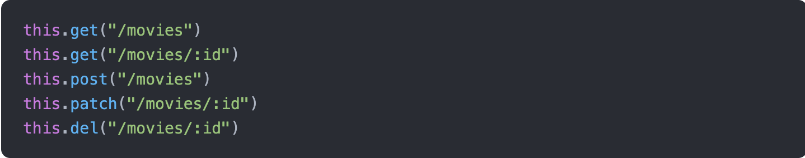

# Palestra: #fackebackend

# Introdução

```
GEORGE:

faz uma capa com essa #fakebackend, porém fazendo alguma brincadeira visual com o conceito de #fakenews.

pode ter ou não um slide anterior só com meu nome, referência à capyba, ao evento, etc. fica a teu critério
```

# 1. Mini história do JavaScript e seus amigos

```
GEORGE:

slide com look bem antigo. sugestão: tela preta com fonte bem tosca escrito somente "1995:". fica a vontade pra mudar o que quiser.
```

> Sem JS, só página estática, ASP, PHP, né.

```
GEORGE:

1. slide full screen só com jurassic park
2. slide full screen só com o outro site
3. slide com php e asp juntos, sempre tentando dar um aspecto de antigo
```


```
GEORGE:

1. slide com a frase "O mundo pedia mais da web! O mundo precisava de mais!"
2. o mesmo slide, porém com o gif daqui de baixo do switch com bolinha de natal
-----
a intenção é eu passar de slide e dar a impressão de que foi adicionada alguma coisa
-----****
```

> Bora botar JS. Dar dinamicidade. Mudar cor, movimentar elementos, inputs, etc.

```
GEORGE:

1. slide com a frase "As coisas evoluíram"
2. slide que dê a ideia de alguma transição de um computador desktop pra um navegador, ou algo do tipo. eu vou falar que as coisas os softwares estavam deixando de ser desktop pra virarem aplicaões web
```

> Evoluão CSS, JS, HTML.
>
> Antigamente tinha flash, o netflix, por exemplo, usava o silver light pra garantir umas paradas de seguranca, hoje o html dá conta.

> JS ganha tração. Pessoal começa a ver que é melhor do que fazer desktop, Delphi, Windows.

> Muito custoso fazer coisa em JS, espicificacao, falta de APIs.

```
GEORGE:

1. slide com frase "Elegeram o presidente Jânio Quários."
2. no mesmo slide, adicionar foto do jquery
```


> fizeram o jquery e se popularizou bastante, resolveu os problemas por muito tempo, porém ajudou o pessoal a desenvolver preaticas estranhas.

## 1.1 Um olhar ficcional sobre a origem dos frameworks

```
GEORGE:

poderia rolar um slide demarcando essa seção, mas não sei como poderia ser. conto contigo!
```

```
GEORGE:

1. slide fazendo essa ilustração de uma galera se reunindo num bar
```

> Uma turminha de amigos se sentaram num bar pra tomar uma cerveja (ou outras coisas aí...).

> "Rapaz, esse negocio de js ta pegando mermo."

> "Um doidão falou "como dizia um filosofo grego: 'se alguma coisa pode ser escrita em javascript, ela vai ser escrita em javascript'"

```
GEORGE:

1. slide mostrando filósofo grego e essa frase do 'se alguma coisa pode ser escrita em javascript, ela vai ser escrita em javascript'"
2. slide em tom de 'errata' mostrando a verdadeira frase e o verdadeiro autor: “Any application that can be written in JavaScript, will eventually be written in JavaScript.”
— Jeff Atwood, Author, Entrepreneur, Cofounder of StackOverflow
```

```
GEORGE:

1. slide mostrando alguém tendo uma ideia. deve mostrar também essas palavras aqui: "UI, async, event loop, single thread, non-blocking".
2. slide de alguém cabisbaixo, pessimista, como se rejeitando essa ideia
3. alguém dando uma ideia salvadora. o conceito é linkar com o divino, salvação, caminho da luz, etc. (cuidado pra não ofender ninguém)
4. alguém fazendo essas perguntas: "e as bibliotecas? e a colaboração?"
```

> Alguém deve ter falado: "Já sei! Genial! Vocês vão ver! A gente propõe uns padrão de projeto massa. Que lida muito com UI, async, event loop, single thread, non-blocking, um nao interrompe o outro, nao pode travar a UI, nao pode demorar muito"
>
> "Vai dar certo não. A turma entrou no Jquery, pra tirar uma pessoa é complicado, ta faltando alguma coisa na vida da pessoa, tem que evangelizar a pessoa, eh dificil tirar. Por que não criamos o ceu na terra. Um framework que ja faz as coisas tudo certo, arquitetura.
>
> "E as biblioteca? Como vamo pensar num jeito pra galera contribuir um com o outro e ja usar as coisas que ja existem hoje e tal..."
>
> Naaaao, mo vei. Cada framework ai faz do seu jeito e se funcionar com JS normal, beleza, senao, quero saber nao.

```
GEORGE:

1. slide mostrando o resultado, contendo essas imagens a seguir. tenta manter essa ordem, porque é por ordem de origem
```


> Isso aconteceu em 87 lugares oa mesmo tempo. Cada um que fosse minion do seu framework, guerras aconecendo no mundo inteiro, ate a galera enteder que nao era por ai.

```
GEORGE:

1. slide mostrando a ideia de que a nova moda pegou!
```

> Tambem, Jquery antes, ne...
>
> Produtividade sucesso
>
> Poderes grandes para o JS
>
> O js tira os elemento, troca a pagina, controla tudo, evento, rota, ajax, dados.
>
> Reativo, massa, muito mais possibilidade, com agilidade, com certa DX.

## Resumo da Ópera

```
GEORGE:

1. slide com o titulo "Resumo" e uma foto grande de Luciano Pavarotti ou qualquer outra coisa/pessoa que lembre uma ópera
2. o título permanece com "Resumo", aí tu diminui a foto da tela anterior e coloca ao lado do título, como se quisesse dizer "resumo da ópera". o centeeudo vai ser essa lista ai, que pode ser divididad em mais de um slide ou nao. pode ser uma timeline tambem, tu que sabes.
```

1990–1995 : HTML, CSS and JavaScript are invented

1996–1999 : Standardization efforts begin. Browser compliance is terrible. Browser wars ignite.

2000–2004 : CSS frameworks begin to emerge. jQuery is born. Frontend package management.

2005–2009 : W3C specification compliance is met. Chrome browser takes the lead. Responsive designs and frameworks are introduced.

2010–2015: JavaScript Frameworks are born i.e. Backbone, Ember, AngularJS, React, Angular, Vue. HTML5 is announced.

2016–2018: GraphQL emerges. Native HTML, CSS & JavaScript become more powerful. New platforms built on-top existing JavaScript frameworks emerge: StoryBook, Motion UI, Gatsby, Next.js.

[Referência: LogRocket](https://blog.logrocket.com/history-of-frontend-frameworks/)

> SPA traz muita vantagem. Ficou evidente. Na Capyba trabalhamos muito.

# 2. Estrutura SPA

```
GEORGE:

1. slide marcando a secão nova
2. slide com a frase "Tá pensando que o céu é perto?", e a foto do "JS" aqui de baixo
3. mesmo slide anterior, porém com a adição de "marminino!!" ou de algum gif
```

> Tem muita coisa lá dentro, vou listar


### Auth

```
GEORGE:

1. slide com título e imagem
```


> cookie, token, jwt, local storage

### Rotas

```
GEORGE:

1. slide com título e imagem
```


> Conteudo hierarquico, paginas, sub paginas, lista, detalhe, etc., arvore
> MPA tambem tem isso.

### Arquitetura / Gerenciamento de estado

```
GEORGE:

1. slide com título e imagem
```


> MVC
>
> MVVM (mermao, as coisa eh muito doida)
>
> MVW (sem comentarios, bota o que quiser ai)
>
> Redux
>
> Padroes: observable, services, repositorios
>
> Bloc
>
> Controlar o estado. Contador: valor atual do contador.
>
> Listagem de alunos: a lista eh o estado. Se estamos esperando o resultado, isso eh estado, se retornou erro, eh estado.
>
> Redux, mobx, change notifiers, etc.

### Componentes

```
GEORGE:

1. slide com título e imagem
```


> Modularizacao, separacao de responsabilidades, reuso, organizacao em geral.
>
> Angular tem, React tem, Vue tem, Web Components! padrao nativo e tal.

### Front do front

```
GEORGE:

1. slide com título e imagem. as três primeiras imagens são de um grupo, as outras três são de outro. podes dar uma separaçãozinha de leve
```


> OOCSS, SMACSS, BEM, functional css, styled components.
>
> Modal, dropdown, tooltip, pegar da biblioteca, implemtnar, jquery
>
> UX? Sentimento do usuario ao executra acoes, encontrando informacoes, app facilitando a vida, stressando, pra que vai fazer, ta no contexto certo, etc.

### Comunicação com api

```
GEORGE:

1. slide com título e imagem. as 2 primeiras imagens são de um grupos, as duas últimas, de outro.
```


> axios
>
> fetch
>
> xml http request
>
> Piada do errrado, tudo na vida eh equilibrio, tem dois pontos de vista, respeitar opiniao, mas aquilo ali eh errado po. Claramente errado. `CODIGO`
>
> serviu! usam por baixo dos panos pra fazer as coisas.

# 3. Vida real!

```
GEORGE:
sequencia de slides somente com pontos. se tu quiser, pode tentar dar uma ideia de sequencia entre os pontos.

1. problema
- Projeto novo
- Escolha de tecnologia: SPA + API
- Pessoa disponível para o frontend
- Ninguém disponível para o backend

2. arrumadinho
- fazer logo a UI, tudo 100% navegável
- cliente e designer ficam felizes
- protótipo de altíssima fidelidade, feedbacks mais genuínos
- se precisar mudar alguma coisa, muito mais barato, não começamos ainda

3. ainda falta algo
- o app tem que ser reativo
- sempre sempre sempre dar resposta ao usuário
- loading..., mensagens de erro, persistência de dados
-
```

> Feature nova, projeto novo.
>
> Tomara que nunca passem por isos, mas se passar, vou contar como fizemos.
>
> Processo de decisao SPA - angular, interface massa e tal, ionic, pwa, etc.

> O dev frontend pede api
>
> So sabe front, vai ser improdutivo
>
> O bicho do back so pode daqui a 3 semanas
>
> Por que nao comeca daqui a 3 semanas?
>
> O cliente e tal, tem que adiantar coisas

> Ai eh isso? Acabou? da ferias pro cara e so volta daqui a 3 semanas?

> Muitas coisas envolvem criar uma SPA

> Voce pensa logo em fazer a UI, navegavel. Protoipo de altissima fidelidade.
>
> Telas navegaveis e tal.
>
> Ai temrina. e a api? o cara so comecou agora. Django new
>
> Ainda vai modelar, vai demorar.
>
> Vai ficar parado? Nao. Tem coisa pra voce fazer.
>
> Coisa muito importante no design eh dar sempre um feedback, uma resposta ao usaurio, tem que ser reativo.
>
> Loading, mensagens de erro, sucesso.

> ## Mostrar esse prototipo mais foda ainda pro cliente

> Chamar junto, dar pra ele testar com side effects reais, melhor ainda que o prototipo navegavel.
>
> Requisitos podem surgir disso, dessa experiencia real do cliente.
>
> Mudancas de modelagem nessa hora seriam muito mais baratas de se implementr.
>
> Assim da pra fazer um deploy bem direitinho pro cliente chegar e dar pitaco.
>
> Tem muito mais chance do cliente dar pitacos legais se tiver a sensacao de que ta acontecendo alguma coisa de verdade la.
>
> Preenche o form, aparece o aluno na listagem, ele filtra, filtra direitinho e tal.
>
> Você pode mandar um deploy pro cliente, com efeitos reais, interacoes perfeitas, loading, erros, cliente pode sentir se as regras de negocio e UI estao atendendo ele.
>
> No prototipo o cliente ve, estuda, da pitaco, itera, mas sempre tem coisa que ele so saca se precisa quando realmente chega la na frente e ele usa.

## Como faz?

```
GEORGE:

1. título: "Como faz?"
- colocar no html os dados estaticamente
- criar model/interface pros dados, instanciá-los e fazer a view recebê-los de verdade
- mockar a requisião no código
- implementar um interceptor para o XMLHttpRequest do browser

2. título: "Funciona?"
- pra fazer funcionar, tem que adicionar codigo irreal
- tambem seria dificil implementar a persistência, dá trabalho, viu?
- no caso do interceptor, teria que tratar a url
```

# 4. Fake backend com MirageJS

```
GEORGE:

1. no slide que demarca essa seção, penso em algo tipo mágica, ou Salvador Dali do telegram
```


> resolve tudo, se nao quiser implementar
>
> se quiser, gostaria de ver uma palestrinha sobre isso!
>
> inclusive, queremos desenvolver isso pro flutter!

```
GEORGE:

1. slide com a capa do site do MirageJS
2. slide com o depoimento do cara lá
3. slide com os pontos:
  - Rotas para tratar as requisições HTTP
  - Um banco de dados e models para guardar os dados e definir relacionamentos
  - Factories e fixtures pra criar dados de exemplo e de teste
  - Serializers para formatar as respostas
```


> routes to handle HTTP requests

> a database and models for storing data and defining relationships

> factories and fixtures for stubbing data, and

> serializers for formatting HTTP responses

## 4.1 Rotas simples

```
GEORGE:

1. início de uma seção
```

### GetAll

```
GEORGE:

1. slide com título e foto
```


> é possível adicionar um parâmetro de timing para simular um delay real de uma requisição. **malicinha para deixar isso randomico**

### Post

```
GEORGE:

1. slide com título e foto
```


### Delete

```
GEORGE:

1. slide com título e foto
```


## 4.2 Rotas dinâmicas

```
GEORGE:

1. slide marcando subseção
```

> É sério! Existe! Funciona!

> Estático é massa, mas bora ver, né. Isso aí a gente faria com as outras soluções. Vamo além!

### 4.2.1 Definindo model:

```
GEORGE:

1. slide com titulo e imagem
```


### 4.2.2 Agora melhorando a função do getAll:

```
GEORGE:

1. slide com titulo e imagem
```


### 4.2.3 Seeds simples!:

```
GEORGE:

1. slide com titulo e imagem
```


### 4.2.4 RESTful routes:

```
GEORGE:

1. slide com titulo e imagem
```


### 4.2.5 Atalhos!

```
GEORGE:

1. slide com titulo e imagem
```



### 4.2.6 O atalho mais rochedo pra tudo:

```
GEORGE:

1. slide com titulo e imagem
```


## 4.3 factories and traits

TODO: botar prints de codigos

- seed eh legal, mas trabalhoso e limitado
- factories permitem abstrair muita coisa, usando indices, coisas aleatorias e turbo com faker
- factories permitem extender e/ou definir so o necessario, muito legal

## Serializers

TODO: prints de codigose exemplos de JSON

- json api
- activemodel
- rest

## relacionamentos

TODO: prints de exemplos

- belongs to
- has many
- o que muda nas rotas
- o que muda nos forms
- o que muda nas queries
- o que muda nas factories

# Agora na vera

Mostrar a aplicacão atual

## revisar o que poderia ser feito pra mockar dados

TODO: LIVECODING

- direto na view
- model no component
- service alterado
- mirage simples

## Listagem

TODO: LIVECODING

- filtros simples
- paginacao
- filtro auto complete entidade relacionada

## Form via modal

TODO: LIVECODING

- validacao uniqueness
- validacao formato
- validacao relativa entre campos

* normalizeAttrs

# Testes

TODO: LIVECODING

- Formato inesperado de dados
- manipulando seeds para casos de testes
  - listas vazias
  - listas enormes, testar paginacao
  - erros de form de uniqueness

## GO NUTS! afterCreate, dependent attributes

## complexidade só o necessário, quando necessário

## finalizando

- angular, react, etc.
- other tools: pretender
- protótipo de altíssima fidelidade
